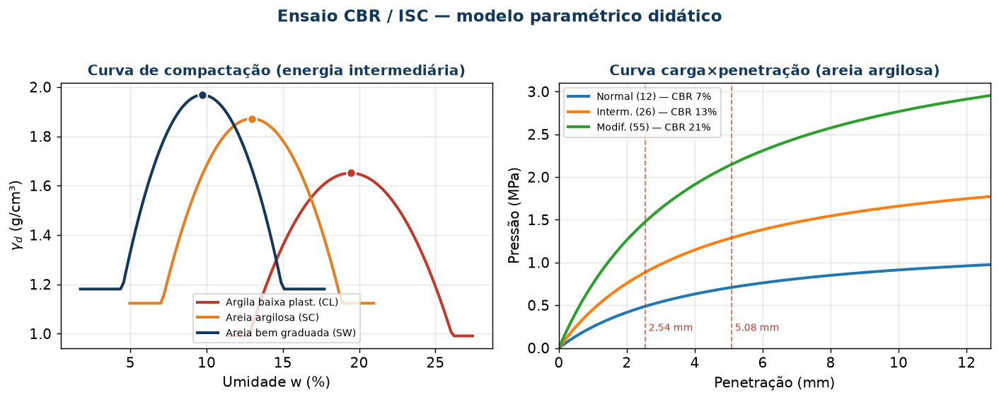

# Ensaio CBR / ISC — Recurso didático interativo

Site estático (HTML + CSS + JavaScript, **sem backend**) para ensinar e **simular** o ensaio de
**Índice de Suporte Califórnia** (CBR — *California Bearing Ratio* / ISC), o ensaio mais utilizado
no dimensionamento de pavimentos flexíveis.

Funciona de três formas: **abrindo o arquivo direto no navegador**, rodando um **servidor local**
no seu PC, ou publicado no **GitHub Pages**. Roda **100% offline** — o Chart.js está incluído no
próprio repositório.

**Recursos:**
- 🌐 **Trilíngue** — Português, Inglês e Espanhol, com seletor no topo (a escolha é lembrada).
- 🌙 **Modo escuro** — alternável no topo (claro/escuro), também lembrado.
- 🔬 **Laboratório virtual** — modos guiado e demonstração; no guiado você **lê o ponteiro** do
  relógio analógico (não há valor numérico "para colar") e registra a carga.
- 📈 Ao concluir o ensaio virtual, os **gráficos** (carga×penetração e compactação) aparecem
  consistentes com o resultado, e um botão abre o **simulador com o mesmo cenário**.



## O que tem no site

| Página | Conteúdo |
|--------|----------|
| **Início** (`index.html`) | Apresentação e navegação |
| **Teoria** (`teoria.html`) | Fundamentos do ISC, compactação, curva γ_d×w, definição de CBR, expansão, classificação e correlações |
| **Procedimento** (`procedimento.html`) | Passo a passo normatizado + tabela de equivalências DNIT/ABNT/ASTM/AASHTO |
| **Laboratório virtual** (`bancada.html`) | 🔬 **Executa o ensaio** como o técnico: molda, aplica golpes, imerge 4 dias, aciona a prensa e lê a carga. Modos **guiado** e **demonstração** |
| **Simulador** (`simulador.html`) | 📈 Varia solo/energia/umidade e mostra em tempo real a curva de compactação, a curva carga×penetração e o CBR. Exporta CSV |
| **Quiz** (`quiz.html`) | 10 questões com feedback e placar |
| **Referências** (`referencias.html`) | Normas, bibliografia e glossário |

## Como rodar

### 1. Modo mais simples — abrir o arquivo
Baixe o repositório (botão **Code → Download ZIP**), descompacte e dê **duplo clique em `index.html`**.
Pronto. Tudo funciona offline.

### 2. Servidor local (recomendado para demonstração em aula)
Alguns navegadores restringem recursos ao abrir via `file://`. Um servidor local evita isso:

```bash
# Python 3 (já vem no Windows/Mac/Linux modernos)
cd ensaio-cbr-didatico
python -m http.server 8000
# abra http://localhost:8000 no navegador
```

Ou, com Node.js instalado: `npx serve` (ou `npx http-server`).

### 3. GitHub Pages (URL pública para os alunos)
Este repositório já inclui o workflow `.github/workflows/pages.yml`. Ao subir para o GitHub com o
**Pages** ativado (Settings → Pages → Source: GitHub Actions), o site fica disponível em:

```
https://<seu-usuario>.github.io/ensaio-cbr-didatico/
```

## Estrutura do projeto

```
ensaio-cbr-didatico/
├── index.html              # Início
├── teoria.html             # Teoria
├── procedimento.html       # Procedimento normatizado
├── bancada.html            # Laboratório virtual (2 modos)
├── simulador.html          # Simulador paramétrico
├── quiz.html               # Quiz
├── referencias.html        # Normas, bibliografia, glossário
├── assets/
│   ├── css/                # style.css (inclui tema escuro), bancada.css
│   ├── js/                 # cbr-core.js (motor), simulador.js, bancada.js, quiz.js,
│   │                       # site.js (nav/tema/i18n), i18n-app.js (traduções da interface)
│   ├── img/                # logo-vortex.png
│   └── vendor/             # chart.umd.min.js (Chart.js, offline)
├── docs/                   # Documentação (guia do professor, base teórica, figuras)
├── .github/workflows/      # Publicação no GitHub Pages
├── LICENSE                 # MIT
└── README.md
```

## O motor de cálculo (`assets/js/cbr-core.js`)

Todo o comportamento do simulador e do laboratório vem de um **modelo paramétrico** que reproduz
as tendências físicas do ensaio:

- **Energia de compactação** → maior energia eleva γ_d e o CBR (normal < intermediária < modificada);
- **Umidade de moldagem** → curva de compactação com pico na umidade ótima; CBR cai no ramo úmido;
- **Tipo de solo** → 7 solos de argila plástica a pedregulho, com CBR e expansão típicos;
- **CBR** = razão entre a pressão medida e a pressão-padrão (6,9 MPa a 2,54 mm; 10,3 MPa a 5,08 mm) × 100.

> ⚠️ **Aviso pedagógico:** os valores são **sintéticos**, gerados para fins de **ensino**. Reproduzem o
> *comportamento* qualitativo do ensaio, mas **não são dados de laboratório** e **não devem ser usados
> em projeto**. Para projeto, ensaie o material real conforme a norma.

## Normas de referência

- **DNIT 172/2016-ME** — Solos: Determinação do ISC (Brasil)
- **ABNT NBR 9895:2016** — Solo: Índice de Suporte Califórnia (Brasil)
- **ASTM D1883** — CBR of Laboratory-Compacted Soils (EUA)
- **AASHTO T193** — The California Bearing Ratio (EUA)

## Documentação

- [`docs/guia-do-professor.md`](docs/guia-do-professor.md) — como usar em aula, roteiros e sugestões de atividades
- [`docs/base-teorica.md`](docs/base-teorica.md) — fundamentação teórica e o modelo de cálculo detalhado

## Créditos

Desenvolvido por **Celso Zanchetta** · [Vortex](https://vortexinfra.com)

- 🌐 Site: [vortexinfra.com](https://vortexinfra.com)
- 💻 GitHub: [github.com/czanchetta](https://github.com/czanchetta)
- 💼 LinkedIn: [Celso Zanchetta](https://www.linkedin.com/in/celsozanchetta/pt/)

## Licença

[MIT](LICENSE) — livre para usar, adaptar e distribuir, inclusive em sala de aula. Mantenha o aviso
de que as simulações são didáticas.
